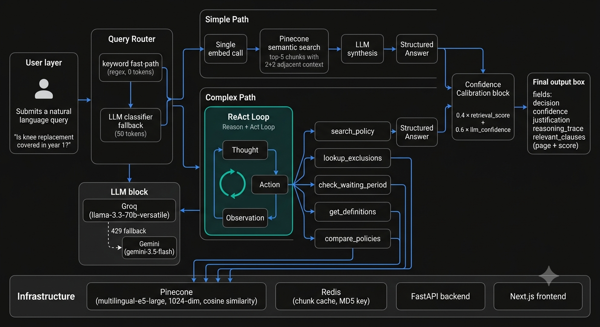

# HackRx RAG — Agentic Insurance Policy Analyzer

An agentic RAG system for insurance policy analysis. Accepts a policy PDF, indexes it into a vector store, and answers natural language coverage questions using a **ReAct reasoning loop** — the LLM reasons step-by-step, calls focused retrieval tools, and returns a structured decision with a full reasoning trace.

---



---

## What Makes This Agentic

Most RAG systems do: embed query → fetch top-k chunks → LLM answers from context. That fails on insurance queries because:
- Coverage decisions often depend on **two clauses in different sections** (e.g., coverage + exclusion + waiting period)
- A single retrieval step may miss the exclusion clause entirely — the LLM then gives a wrong answer with high confidence

This system uses a **ReAct (Reason + Act) loop** instead:

```
Thought → Action (tool call) → Observation (retrieved chunks)
       → Thought → Action → Observation
       → ...
       → Final Answer
```

The LLM decides at each step what to retrieve next, based on what it already knows. It can call `lookup_exclusions` after `search_policy` if the first result doesn't settle the question. Each step is logged and returned as a `reasoning_trace` in the API response — the reasoning is observable, not a black box.

---

## How a Query Flows Through the System

```
User Query
    │
    ▼
┌─────────────────────────────────────┐
│           Query Router              │
│  keyword fast-path → simple/complex │
└─────────────┬───────────────────────┘
              │
    ┌─────────┴──────────┐
    │                    │
    ▼                    ▼
SIMPLE PATH         COMPLEX PATH
1 embed call        ReAct loop (up to 4 steps)
direct search       LLM decides which tool to call
    │                    │
    └─────────┬──────────┘
              ▼
    ┌─────────────────────┐
    │  Calibrated Answer  │
    │  decision           │  covered / not_covered / partial / unclear
    │  confidence         │  0.4×retrieval_score + 0.6×llm_confidence
    │  justification      │  clause text + reasoning
    │  reasoning_trace    │  step-by-step thought/action/observation
    │  relevant_clauses   │  source document + page
    └─────────────────────┘
```

### Query Router

Before any LLM call, the query is classified as `simple` or `complex`:

1. **Keyword fast-path** — regex patterns on known signals. `waiting period`, `pre-existing`, `first year`, `X and Y` → complex. `what is`, `define`, `sum insured` → simple. No LLM call.
2. **LLM classifier fallback** — for ambiguous queries, one Groq call (`max_tokens=10`) returns `simple` or `complex`. ~50 tokens.

Simple queries skip the ReAct loop entirely — 1 embed call, direct semantic search, one LLM synthesis call. Response in ~2s vs ~15s.

### ReAct Loop (Complex Path)

The agent has 5 retrieval tools:

| Tool | Purpose |
|---|---|
| `search_policy(query)` | General semantic search across the indexed policy |
| `lookup_exclusions(condition)` | Targeted search biased toward exclusion sections |
| `check_waiting_period(benefit)` | Targeted search biased toward waiting period clauses |
| `get_definitions(term)` | Targeted search biased toward definition sections |
| `compare_policies(query)` | Search grouped by source document |

Each tool returns top-k chunks with document name, page number, and cosine similarity score. The LLM sees these as observations and decides whether to call another tool or conclude.

The parser handles 3 output formats from Llama 3.3 (JSON args, inline args, key=value style). If `MAX_STEPS = 4` is reached without a `Final Answer`, a forced-answer prompt extracts the best conclusion from accumulated evidence.

### Confidence Calibration

The confidence score is not LLM self-report — it is anchored to retrieval quality:

```
retrieval_score = mean cosine similarity of top-3 retrieved chunks  (0–1, Pinecone)
confidence      = 0.4 × retrieval_score + 0.6 × llm_confidence
```

If the best matching chunks score 0.55 cosine similarity, the confidence is pulled down regardless of what the LLM claims. For the ReAct path, retrieval scores are parsed from observation strings in the trace.

### LLM Stack

- **Primary**: Groq `llama-3.3-70b-versatile` — fast inference, OpenAI-compatible API
- **Fallback**: Gemini `gemini-3.5-flash` — triggered automatically on any Groq 429

The fallback is transparent to all call sites. On a Gemini rate limit, the actual `retry_delay.seconds` is parsed from the error body and waited precisely. On daily quota exhaustion (`per day` in error), retrying stops immediately — no wasted tokens.

---

## Chain-of-Thought in Practice

**Query**: *"Is knee replacement surgery covered if the policy is 2 months old?"*

```
Step 1
  Thought: "This involves a surgical procedure with a potential waiting period.
            I should first check if knee replacement falls under specified diseases."
  Action:  check_waiting_period("knee replacement surgery")
  Found:   5 chunks — Schedule of Specified Diseases, 24-month waiting period
           for surgical procedures including joint replacements. score=0.87

Step 2
  Thought: "Knee replacement is explicitly listed. Policy is 2 months old,
            24-month wait applies. Need to confirm no exceptions exist."
  Action:  lookup_exclusions("knee replacement first year")
  Found:   3 chunks — General exclusion clause confirming specified disease
           waiting period applies from policy inception. score=0.81

Final Answer: NOT COVERED
  Justification: Knee replacement surgery falls under specified diseases
  with a 24-month waiting period from policy inception. The policy is
  only 2 months old (22 months remaining). Clause: Schedule III, Row 14.
  Confidence: 0.83
```

This trace is returned in the API response and will be surfaced step-by-step in the frontend UI.

---

## Project Structure

```
hackrx-llm-query-system/
├── backend/
│   ├── src/
│   │   ├── llm_client.py              # Groq + Gemini fallback, unified call_llm()
│   │   ├── query_processor.py         # Simple path + ReAct path orchestration
│   │   ├── query_router.py            # Keyword fast-path + LLM classifier
│   │   ├── react_agent.py             # ReAct loop, step parser, forced-answer
│   │   ├── agent_tools.py             # 5 retrieval tools
│   │   ├── parse_documents.py         # PDF parsing with PyMuPDF
│   │   ├── chunk_documents_optimized.py  # Semantic chunking (800 char, 2+2 adjacent)
│   │   ├── embed_and_index.py         # Pinecone upsert, multilingual-e5-large
│   │   ├── backend.py                 # FastAPI routes + chunk cache
│   │   ├── pipeline.py                # End-to-end processing pipeline
│   │   ├── telemetry.py               # Per-query telemetry logging
│   │   └── document_registry.py       # MD5-based doc registry
│   ├── api/
│   │   └── main.py                    # FastAPI app entry point
│   ├── eval/
│   │   ├── ground_truth.json          # 15 Q&A pairs from actual policy
│   │   ├── run_eval.py                # Sequential eval harness
│   │   └── results/                   # Timestamped eval outputs
│   ├── docs/
│   │   └── BAJHLIP23020V012223.pdf    # Bajaj Allianz Global Health Care policy
│   ├── requirements.txt
│   ├── Dockerfile
│   └── .env
│
├── frontend/
│   ├── src/
│   │   ├── app/
│   │   │   ├── page.tsx               # Main query interface
│   │   │   └── layout.tsx
│   │   ├── components/
│   │   │   ├── QueryInput.tsx
│   │   │   ├── ReasoningTrace.tsx     # Step-by-step trace reveal
│   │   │   ├── DecisionBadge.tsx      # Covered / Not Covered badge
│   │   │   └── ConfidenceBar.tsx
│   │   └── lib/
│   │       └── api.ts                 # Typed API client
│   ├── .env.local                     # NEXT_PUBLIC_API_URL
│   └── package.json
│
└── README.md
```

---

## API

The backend exposes a single primary endpoint:

```
POST /process-document-and-query
Content-Type: multipart/form-data

file     : PDF file
question : string
```

**Response:**
```json
{
  "evaluation": {
    "decision":    "not_covered",
    "confidence":  0.83,
    "answer":      "Knee replacement is not covered ...",
    "justification": "24-month waiting period applies ...",
    "relevant_clauses": [
      { "document": "BAJHLIP23020V012223.pdf", "page": 12, "score": 0.87 }
    ]
  },
  "reasoning_trace": [
    {
      "step": 1,
      "thought": "This involves a surgical procedure ...",
      "action":  "check_waiting_period",
      "args":    { "benefit_type": "knee replacement surgery" },
      "observation": "Found 5 chunks — Schedule of Specified Diseases ..."
    },
    {
      "step": 2,
      "thought": "Knee replacement is listed. Need to confirm exclusion ...",
      "action":  "lookup_exclusions",
      "args":    { "procedure_or_condition": "knee replacement first year" },
      "observation": "Found 3 chunks — General exclusion clause ..."
    }
  ],
  "query_type": "complex",
  "processing_time_ms": 14230
}
```

---

## Local Setup

**Prerequisites**: Python 3.10+, Node.js 18+

### Backend

```bash
cd backend
python -m venv venv
venv\Scripts\activate        # Windows
source venv/bin/activate     # macOS/Linux

pip install -r requirements.txt
```

Create `.env`:
```env
PINECONE_API_KEY=your_key
GROQ_API_KEY=your_key
GEMINI_API_KEY=your_key
```

```bash
uvicorn api.main:app --reload --port 8000
```

### Frontend

```bash
cd frontend
npm install
```

Create `.env.local`:
```env
NEXT_PUBLIC_API_URL=http://localhost:8000
```

```bash
npm run dev
```

---

## Evaluation

15 ground-truth Q&A pairs derived from the actual Bajaj Allianz policy (`BAJHLIP23020V012223.pdf`). Mix of 6 complex and 9 simple queries.

```bash
cd backend
python eval/run_eval.py --policy docs/BAJHLIP23020V012223.pdf
```

Metrics reported:
- **Decision accuracy** — exact match on `covered/not_covered/partial/unclear`
- **Clause recall** — expected keywords appear in answer + justification
- **Mean confidence** — correct vs incorrect answers (validates calibration)
- **Simple vs complex accuracy** — breakdown by query type

Questions run sequentially with 3s gaps to stay within API rate limits.

---

## Engineering Notes

| Decision | Reason |
|---|---|
| ReAct over single-shot | Multi-hop insurance queries need sequential retrieval — first coverage, then exclusion, then waiting period. Single-shot gets one chance. |
| Query router | Saves 3-4 LLM calls and ~12s on simple factual queries. Keyword fast-path costs 0 tokens. |
| 2+2 adjacent chunks | Previous 25+25 = 255 chunks = ~74k tokens per call = guaranteed rate limit. 2+2 captures full clause context at ~6k tokens. |
| Retrieval-anchored confidence | LLM self-confidence is uncalibrated. Blending with Pinecone cosine similarity grounds the score in actual retrieval quality. |
| Groq primary + Gemini fallback | Groq is faster. Gemini has 10x daily token budget. Fallback is automatic, parses actual retry_delay from error body. |
| Module-level chunk cache | Avoids 380s re-parse on repeated queries. Redis swap is a one-function change for deployment. |

---

## Tech Stack

| Layer | Technology |
|---|---|
| LLM (primary) | Groq — `llama-3.3-70b-versatile` |
| LLM (fallback) | Google Gemini — `gemini-3.5-flash` |
| Embeddings | Pinecone inference — `multilingual-e5-large` (1024-dim) |
| Vector DB | Pinecone (serverless) |
| PDF parsing | PyMuPDF |
| Backend | FastAPI + uvicorn |
| Frontend | Next.js 14 + TypeScript |
| Cache | Redis (Upstash) — planned |
| Deployment | Railway (backend) + Vercel (frontend) — planned |

---

